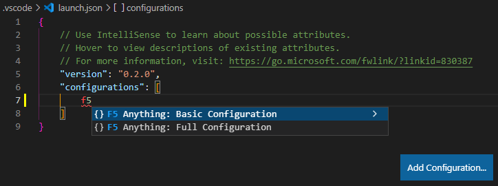

# [F5 Anything](https://marketplace.visualstudio.com/items?itemName=discretegames.f5anything)

Lets you put any normal console command or VSCode command into a launch.json configuration
so you can run it with F5 (or whatever your normal run/debug keybind is).

Simply install the extension then add a configuration like this to the
[launch.json](https://code.visualstudio.com/docs/editor/debugging#_launch-configurations) file in the .vscode folder of your workspace:

```json
{
    "name": "F5 Anything: My Custom Command",
    "type": "f5anything",
    "request": "launch",
    "command": "echo Put your command here",
}
```

Replace the `echo Put your command here` with whatever command you want. It may include
[variables such as `${file}`](https://code.visualstudio.com/docs/editor/variables-reference).
When the launch configuration is run, the command will be run in a
[VSCode integrated terminal](https://code.visualstudio.com/docs/editor/integrated-terminal).

The full launch.json would look like:

```json
{
    "version": "0.2.0",
    "configurations": [
        {
            "name": "F5 Anything: My Custom Command",
            "type": "f5anything",
            "request": "launch",
            "command": "echo Put your command here",
        }
    ]
}
```

## VSCode/VSCode Extension Commands

If instead (or additionally) you want to run an internal [VSCode command](https://code.visualstudio.com/api/references/commands) or VSCode extension command (normally accessed from the Ctrl+Shift+P menu), put the command ID as the value of the `"vscCommand"` JSON key. For example, this configuration will show the Open File dialog when F5 is hit:

```json
{
    "name": "F5 Anything: Open File",
    "type": "f5anything",
    "request": "launch",
    "vscCommand": "workbench.action.files.openFile",
}
```

To get a command ID:

1. Find your command in the Ctrl+Shift+P menu
2. Click the small gear symbol next to it that opens Keyboard Shortcuts
3. Right click your command and hit Copy Command ID
4. Paste it into your launch configuration as the "vscCommand" value

If `"command"` and `"vscCommand"` both exist in a launch configuration they will both be run.
When either is the empty string `""` it is ignored and does nothing.

## Configuration Details

A quick way to add launch configurations is the "Add Configuration..." button on the bottom right of a launch.json.
Hit that and start typing "F5 Anything" for a premade configuration:



The basic configuration only has the necessary configuration properties (`"name"`, `"type"`, `"request"`, and `"command"` or `"vscCommand"`). The full configuration has three additional optional properties that relate to `"command"`:

-   `"terminalName"` (string, defaults to `"F5 Anything"`):
The name given to the dedicated integrated terminal F5 Anything creates for itself.

-   `"terminalIndex"` (integer, defaults to `-1`):
The index of the integrated terminal in the VSCode terminal list to send commands to. When -1 or out of range
a dedicated terminal is created and used. Note that terminals are 0-indexed in order of creation, not by visual order.

-   `"showTerminal"` (boolean, defaults to `true`):
Whether or not the terminal an F5 Anything command is sent to is given focus.

So, for example, this launch configuration will send commands to the terminal at index 0 but not switch focus to it:

```json
{
    "name": "Another Example",
    "type": "f5anything",
    "request": "launch",
    "command": "echo Hi",
    "terminalIndex": 0,
    "showTerminal": false
}
```

When `"command"` is missing or the empty string and only `"vscCommand"` is present, then all of `"terminalName"`, `"terminalIndex"`, and `"showTerminal"` are ignored as they do not apply.

See [the example workspace](https://github.com/discretegames/f5anything/tree/main/exampleWorkspace)
and especially [its launch.json](https://github.com/discretegames/f5anything/blob/main/exampleWorkspace/.vscode/launch.json) for some more launch configuration examples.

## Resources

-   [Change Log](https://marketplace.visualstudio.com/items/discretegames.f5anything/changelog)

-   [GitHub Repo](https://github.com/discretegames/f5anything)

-   [Marketplace Page](https://marketplace.visualstudio.com/items?itemName=discretegames.f5anything)

-   [VSCode Predefined Variables Reference](https://code.visualstudio.com/docs/editor/variables-reference)

-   [VSCode Built-in Commands](https://code.visualstudio.com/api/references/commands)
